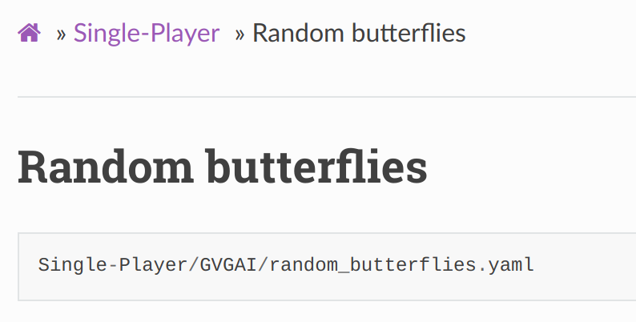

# Griddly Entity Neural Network Wrappers

Griddly is a platform for building high-performance grid-world environments for reinforcement learning.

## Available Environments

Currently, the only environment available is `GDY-Clusters` which implements the [Clusters](https://griddly.readthedocs.io/en/latest/games/Clusters/index.html) game. 

there are 5 levels available which can be used by loading one of the following environment names:
`GDY-Clusters-0`
`GDY-Clusters-1`
`GDY-Clusters-2`
`GDY-Clusters-3`
`GDY-Clusters-4`

## Adding new environments


Griddly envs are currently added by referencing the yaml (GDY) and specifying the level number defined in the GDY:
```
GRIDDLY_ENVS: Dict[str, Type[Environment]] = {
    "GDY-Clusters-0": create_env(os.path.join(init_path, "env_descriptions/clusters.yaml"), level=0),
    "GDY-Clusters-1": create_env(os.path.join(init_path, "env_descriptions/clusters.yaml"), level=1),
    "GDY-Clusters-2": create_env(os.path.join(init_path, "env_descriptions/clusters.yaml"), level=2),
    "GDY-Clusters-3": create_env(os.path.join(init_path, "env_descriptions/clusters.yaml"), level=3),
    "GDY-Clusters-4": create_env(os.path.join(init_path, "env_descriptions/clusters.yaml"), level=4)
}
```

### Adding a standard Griddly environment
To add a new environment from Griddly's built-in library, you can add to this list using the yaml-path found at the top 
of the game description in the documentation 


You can then add this to the list in the following way
```
    "GDY-Butterflies-0": create_env("Single-Player/GVGAI/random_butterflies.yaml", level=0),
```

### Adding a custom Griddly environment

To use a custom GDY description, you can add the full path to the GDY file, images and custom shaders if they are required
```
"GDY-Custom-Env-0": create_env("/full/path/to/my.yaml", images_path="/full/path/to/images/", shader_path="/full/path/to/shaders", level=0),
```


## Full Griddly Documentation

Here -> https://griddly.readthedocs.io/en/latest/